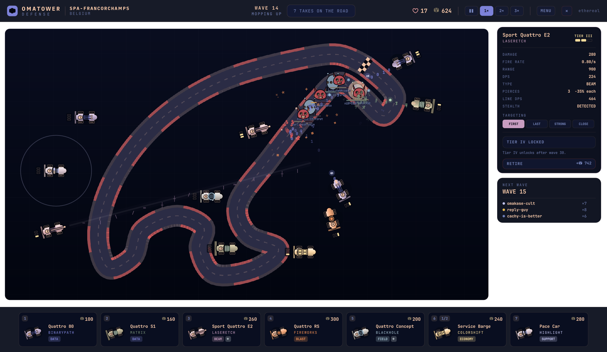

# Omatower Defense

Tower defense on real Grand Prix circuits, as a native Omarchy shell plugin.

You park Audi Quattros around a lap. The takes about Omarchy drive it — *not a
distro*, *bloatware*, *shell-script-slop*, *cachy-is-better*, *THE-NIXPILL* —
and if one completes the lap and crosses your start/finish line, you lose a
life. The cars shoot back with the effects from Omarchy's own `ttfx`
screensaver: `binarypath`, `matrix`, `laseretch`, `fireworks`, `blackhole`.

Everything is drawn in QML — no sprite sheets, no assets — and the whole game
recolours itself from your current Omarchy theme, light or dark.



<sub>Spa-Francorchamps, wave 14, under the Ethereal theme. Every colour on screen
came from `colors.toml`.</sub>

## Install

```bash
omarchy plugin add https://github.com/perfektnacht/omatower-defense --enable
```

Or, to hack on it, symlink the checkout into your plugins directory and
enable it:

```bash
ln -s "$PWD" ~/.config/omarchy/plugins/perfektnacht.omatower-defense
omarchy plugin enable perfektnacht.omatower-defense
```

Open it with the car icon in the bar, or bind a key to:

```bash
omarchy-shell shell toggle perfektnacht.omatower-defense
```

Hiding the overlay pauses the run rather than throwing it away, so you can duck
out mid-wave and come back.

**Switching workspace hides it too.** A layer-shell overlay floats above every
workspace, so without this the game would sit on top of whatever you switched to
with nothing clickable underneath. Leaving its workspace closes the overlay and
pauses the run where it stands; the bar icon brings it back untouched.

### Without Omarchy

It also runs as a plain window on any Quickshell install:

```bash
qs -p .
```

## Removal

```bash
omarchy plugin remove perfektnacht.omatower-defense
```

That disables it and deletes the plugin directory. If you installed by hand
with the symlink above, the plugin directory is a link to your checkout, so
remove the link and leave the checkout alone:

```bash
omarchy plugin disable perfektnacht.omatower-defense
rm ~/.config/omarchy/plugins/perfektnacht.omatower-defense
```

Nothing else to clean up: the game writes no config, no save files and no state
outside its own plugin directory. It only ever *reads* your theme from
`~/.local/state/omarchy/current/theme/`.

## Controls

| Key | Action |
|-----|--------|
| `Enter` | Start the run from the circuit picker (`←`/`→` choose a circuit) |
| `1`–`7` | Pick a car, then click a parking bay to park it |
| Left click | Place, or select a parked car |
| Right click | Cancel placement / deselect |
| `Space` | Call the next wave early (pays a bonus), or pause mid-wave — and always resumes |
| `P` | Pause. The board greys out, placement is locked, and resuming returns to 1× |
| `U` / `S` | Develop / retire the selected car |
| `T` | Cycle its targeting priority |
| `Esc` | Cancel, then deselect, then close (closes straight away on the picker) |
| MENU | End the current run and go back to the circuit picker (click twice to confirm) |
| `R` | Restart after a loss |

## How it plays

**Damage types.** No single car clears everything.

| Type | Cars | Notes |
|------|------|-------|
| `DATA` | Quattro 80, Quattro S1 | Bread and butter, blunted by armour |
| `BEAM` | Sport Quattro E2 | Ignores armour entirely, but attenuates through a queue |
| `BLAST` | Quattro RS | Splash, but plenty of takes resist it |
| `FIELD` | Quattro Concept | Slows and chips; `arch-btw` is immune |

**The beam attenuates.** Every take walks the same racing line in single file,
so a beam that pierces five targets for full damage is effectively free
multi-target: it is *always* lined up with the convoy. Each successive take it
punches through takes 35% less — at tier IV that reads 495 / 322 / 209 / 136 /
88, so a full line is worth 2.53× one target rather than 5×. The E2 stays the
long-range armour-ignoring sniper it is meant to be without being the only car
worth parking.

**Stealth is a hard gate.** `cachy-is-better` is invisible to any car without
packet inspection. The E2 has it natively, the Quattro 80 gains it at level 3,
and a level-3 Pace Car shares it with everyone in range. Bring one or it walks
straight past you.

**Armour, shields and No Cash.** Armour is flat mitigation that `BEAM` skips
entirely. `reply-guy` carries a regenerating shield that wants burst damage,
not chip. And `syu-and-pray` splits into two halves on death that pay
**nothing** — as do the minions `THE-ALGORITHM` summons. Waves that pay no
bounty are how a run quietly starves.

**Economy and support.** The Service Barge cannot shoot; it pays out at the end
of every wave, and you may run at most two. The Pace Car cannot shoot either;
it buffs fire rate and range for neighbours, and cleanses the tower stuns that
`ENGAGEMENT-FARM` throws out.

**Being stunned.** When a stun lands, the HUD says how many cars it caught, the
ticker says for how long, and every frozen car wears a pulsing ✖ ring with a
draining timer and fades out — so a stun on the far side of the lap is something
you *see*, not something you work out afterwards from the lives you lost. If a
Pace Car absorbed the whole pulse, it says that too.

**Targeting priority.** Every damage car can be set to `FIRST`, `LAST`,
`STRONG` or `CLOSE`. Left on `FIRST`, your guns chew on the tanky frontliner
while the glass cannon behind it walks to your machine.

**Bosses.** `THE-NIXPILL` every 10 waves. Every 30 you get all three of the
others at once: `THE-ALGORITHM` soaks the shots meant for what is behind it,
`ENGAGEMENT-FARM` stuns your cars and hastes its friends, and `DISTRO-HOPPER`
is fragile, fast, and costs ten lives if it gets through.

**Where you can build.** Cars go in fixed parking bays laid out beside the
circuit, shown as soon as you pick a car from the shop. Bays are generated
clear of the whole lap, so a car can never end up straddling the racing line no
matter which way it rotates to aim. A tight circuit simply generates fewer of
them — Spa has 39 bays, Monza 50 — and that is what makes a layout a level.

**The first car starts the clock.** Nothing is on a timer until you park
something. Until then a ghost take drives a demonstration lap and arrows march
along the asphalt, so you can read the route before committing to a bay.

**Reading the board.** Every parked car carries a four-bar rank plate off its
tail: filled bars are tiers bought, empty ones are tiers left. It is bolted to
the bodywork, so it turns with the car and stays off the circuit — you can see
what every car is worth without clicking a single one.

**Development tiers.** Three tiers are available from the start. The fourth
unlocks only after wave 30, and it is a big jump: the E2 goes from a
three-target beam to a five-target one, the RS clears eighteen takes in a burst.

**The debrief.** Losing opens a summary of the run: how much damage every car
type dealt, with a share bar and the car drawn beside it, and every take you
shot down with its sprite, its name and how many of them you refuted. Damage is
tallied by car *definition*, not by instance, so retiring a car on wave 12 does
not erase what it did. From there you can run it back, change circuit, or exit.

**Money.** Bounties, wave bonuses and barge payouts all decay as the wave
number climbs — a kill on wave 30 pays under half what the same kill paid on
wave 5 — while enemy health grows superlinearly and then compounds every round
past wave 30. Income is meant to lose that race. Service Barges are also capped
at two per run, because the alternative is an economy that solves itself.

## Circuits

| Circuit | Difficulty | Character |
|---------|-----------|-----------|
| Monza | Rookie | Huge straights, long sightlines, acres of paddock |
| Silverstone | Rookie | Fast and flowing with a slow Arena loop |
| Spa-Francorchamps | Pro | Enormous lap, so economy has time to pay for itself |
| Suzuka | Pro | The lap crosses itself; one car can cover both halves |
| Monaco | Legend | Barely any runoff. Every placement has to earn its space |

**Classic** offers every car. **Draft** deals a random five-car hand each run —
always including one detector and one economy car — so the same opening does
not work every time.

## Theming

The palette comes from `~/.local/state/omarchy/current/theme/colors.toml`, live —
run `omarchy theme set` and the game recolours without a reload. Both schemas are
read (the named one and the older `color0..color15`), along with Aether's
`mode = "light" | "dark"`.

**Switching repeatedly works.** `omarchy-theme-set` does not edit `colors.toml`,
it does `rm -rf` on the theme directory and `mv`s a new one into place, so every
switch hands over a brand new inode. A file watch is attached to an inode, not a
path: the first switch kills the watch along with the old file and every switch
after it goes unnoticed. Worse, a read landing between the `rm` and the `mv`
returns nothing, and a naive reader collapses to its built-in fallback and stays
there. So the watch is re-armed when it fires, a one-second poll backs it up, and
an empty read is never allowed to overwrite a good palette.

The whole palette also resolves in a **single binding**. It used to be a chain
(`raw → themeHues → concentration → collapsed → roles → red`), and QML
invalidates a chain by pushing change signals through it — a lazy link nobody has
read yet never fires, so everything downstream keeps serving cached values. The
symptom was a half-applied theme: backgrounds and text switched instantly while
every car and every take kept the previous theme's colours.

A terminal palette does not owe a tower defense two things it needs, so the game
derives them:

**Seven separable accents.** Aether's Monochromatic, Muted and Pastel modes
legitimately collapse every ANSI hue onto one — a real shipped theme has `red`,
`orange` and `magenta` as byte-identical blues. Damage types, affordability and
seventeen distinct takes all stop reading. So the palette is measured: circular
variance of its hues, weighted by the chroma each actually carries.

- **Distinct palette** → the theme's own hues are used exactly as authored. If
  two specific roles are close enough to be confused, only the second of the
  pair moves, and it moves in lightness first so the hue survives.
- **Collapsed palette** → rebuilt as an analogous fan across a 120° arc around
  the theme's own hue, with alternating lightness. It still reads as one family,
  which is the point: it looks like a scheme, not like the game ignoring you.
- **Zero chroma** → separated by lightness alone. Painting a rainbow over a
  deliberately greyscale theme would be vandalism.

**Text that survives its background.** Every text role is held to WCAG AA
against *every* surface it is drawn on — `bg`, `bgPanel`, `bgRaised`, `bgLift` —
not just one of them, and correction tries both directions rather than assuming
away-from-the-background is the way out. A mid-tone accent can be unreachable
toward white and comfortable toward black. A colour is only touched when it
really fails; a well-authored theme passes through untouched.

**Surfaces have to stay on the background's side.** Some shipped themes define
only `foreground`, `background` and `selection`, and `selection` is often a
near-white highlight meant to carry dark text. Used as a panel on a near-black
theme it produces a surface no text colour can satisfy alongside the real
background. Anything that far out of line with the theme's mode is derived from
the background instead of used as-is.

`tools/dev.sh themecheck` grades every theme Omarchy ships **and** every theme
you have installed **and** the fixtures in `tools/themes/` (light,
monochrome-light, greyscale) — 29 palettes on a stock machine. It prints the
resolved mode, the contrast ratio and grade for each pair, the seven resolved
hues, and the closest pair among them, and holds themes to the same threshold the
code enforces, because a harness grading against a different bar is worse than no
harness.

## Layout

```
manifest.json     plugin manifest (overlay + bar-widget, keepLoaded)
Panel.qml         overlay entry point for omarchy-shell
BarWidget.qml     the car icon in the bar
shell.qml         standalone entry point (qs -p .)
game/
  Balance.qml     all config: cars, takes, waves, circuits. Data only
  Sim.qml         coordinator: wallet, clock, wiring
  Stats.qml       the run ledger: damage by car, kills by take
  EnemyManager.qml, TowerManager.qml, ProjectileManager.qml, WaveManager.qml
  Battlefield.qml, Quattro.qml, Creature.qml, EnemyChip.qml, Fx.qml, ...
  Theme.qml       live Omarchy palette: mode, WCAG contrast, hue separation
tools/dev.sh      dev harnesses (see below)
```

The managers hold no rendering code and run fine with no view layers attached,
which is what lets the balance be tested headlessly.

## Development

```bash
tools/dev.sh simtest       # headless mechanics + balance checks
tools/dev.sh viewtest      # view/entity parity and health bars
tools/dev.sh combatview    # real Game: combat health bars + inspector updates
tools/dev.sh preview 3     # play a circuit (0-4), screenshots to $SHOT
                           #   SCENARIO=rank|route|pause|over for those states
tools/dev.sh artcheck      # every car and creature, side by side
tools/dev.sh monotest      # each damage car played solo, to compare them
tools/dev.sh themecheck    # every installed theme + fixtures, graded
tools/dev.sh safetext      # untrusted file text cannot become rich text
```

**You never need to reinstall.** A symlink install points the plugins
directory at this checkout, so the files the shell reads are always the files
you just edited. Only the shell's *in-memory* copy goes stale.

Saving a file under `~/.config/omarchy/plugins/` normally hot-reloads it, but
the watcher does not follow the symlink out to this directory, so after editing:

```bash
tools/reload.sh          # hot reload, verified; restarts the shell if needed
tools/reload.sh --soft   # hot reload only, never restart
tools/reload.sh --hard   # go straight to a shell restart
```

`reload.sh` stamps the sources into `game/BUILD`, reloads, then asks the running
shell what it actually has via `omarchy-shell shell call ... buildInfo`. If the
hot path did not take it restarts the shell and re-checks, so the command either
prints the build you just wrote or fails loudly.

That check exists because a long-running shell can wedge its reload state, after
which every `rescanPlugins` is a silent no-op and you end up debugging code the
shell is not running. The same stamp is printed on the circuit picker, so you can
always see which build is on screen.

Balance lives entirely in `game/Balance.qml`. Adding a take, retuning a car or
drawing a new circuit never touches the managers.

## Credits

Built for [Omarchy](https://omarchy.org). Weapon names and glyph effects are
lifted from Omarchy's `ttfx` screensaver. Packaging follows the path
[Quattrolitaire](https://github.com/28allday/Quattrolitaire) laid out for
native shell-plugin games.

The colour handling is shaped by [Aether](https://github.com/bjarneo/aether) by
[bjarneo](https://github.com/bjarneo), the theme generator Omarchy ships for
custom theme development. Aether is what taught this game which palettes it
actually has to survive: its Monochromatic, Muted and Pastel extraction modes
collapse the ANSI hues onto one, its light mode swaps the anchors out from under
you, and its WCAG grader sets the bar themes are authored against. The hue
separation and contrast rules above exist because Aether makes all three of
those a normal thing for a user to be running, not an edge case.

MIT.
